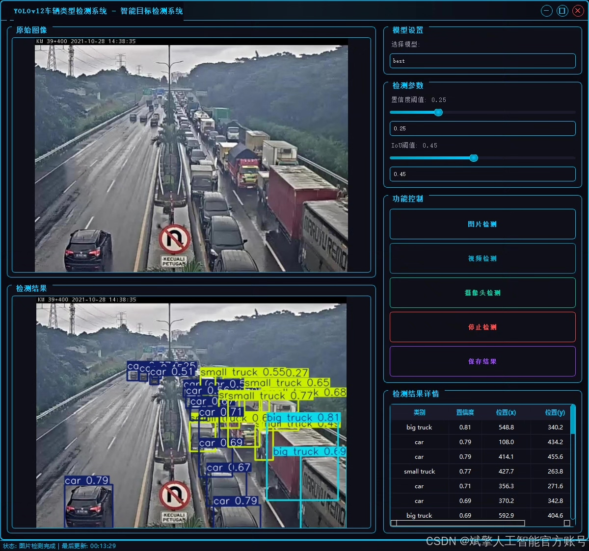
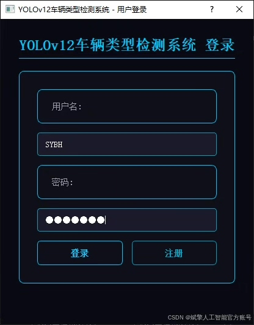
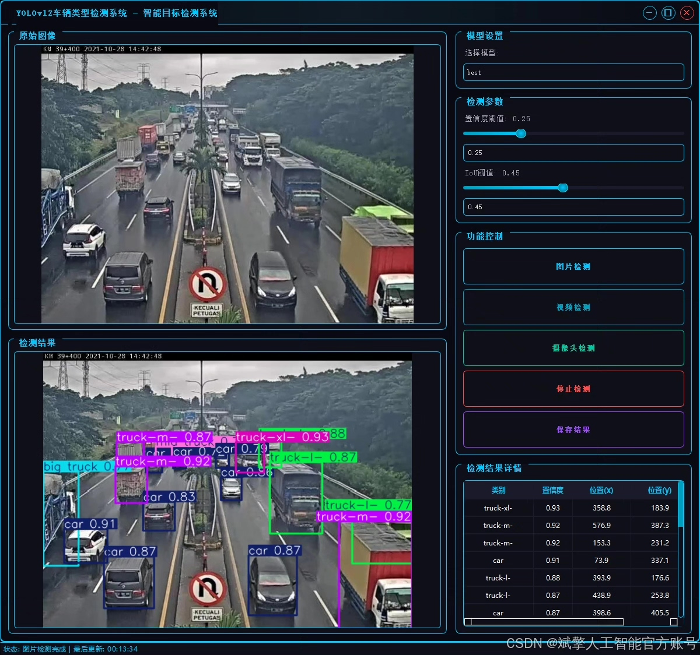
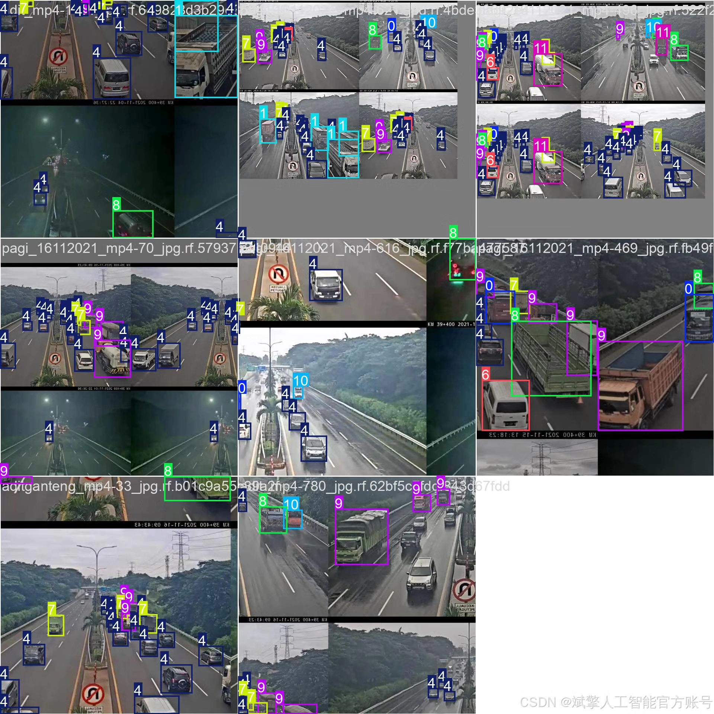
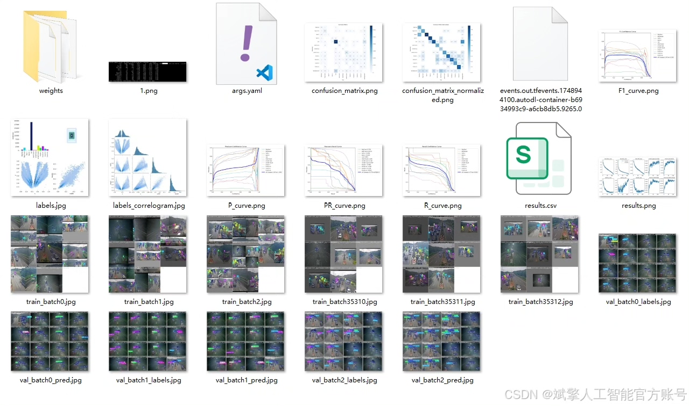
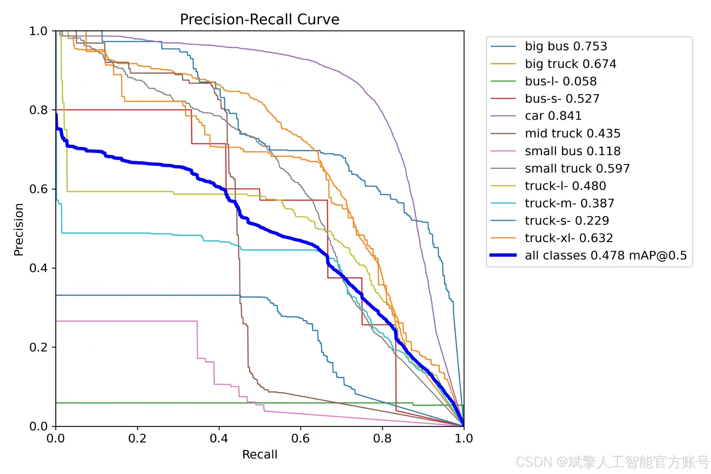
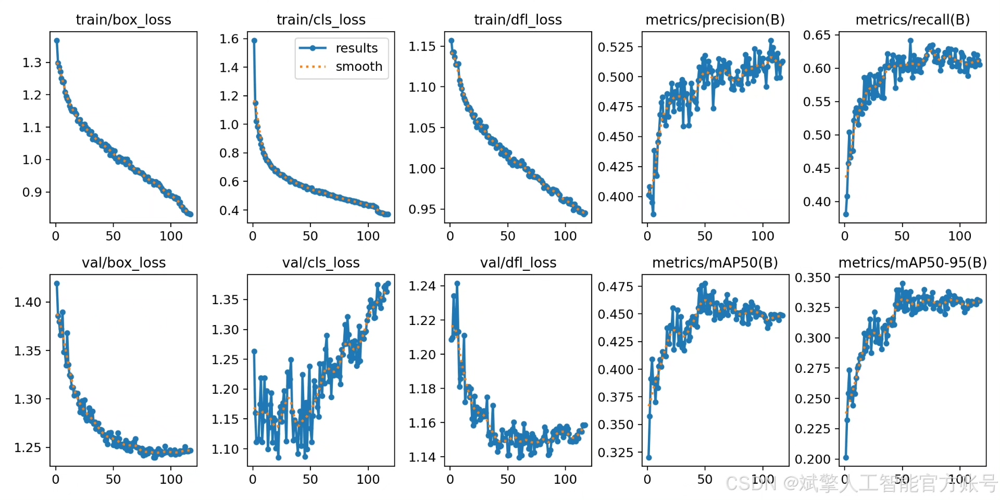
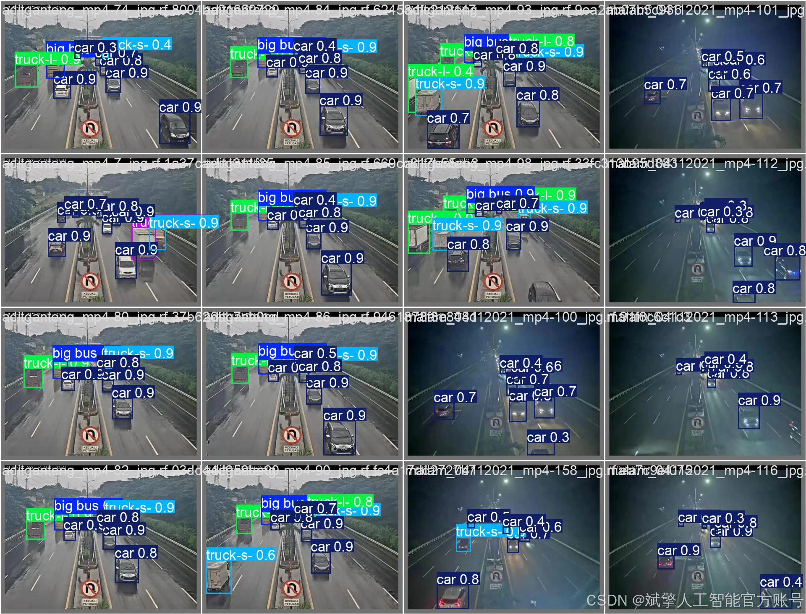

# YOLOv12 vehicle type recognition system

## Body

This paper designs and implements an efficient vehicle type recognition detection system based on the YOLOv12 deep learning framework. The system supports 12 vehicle types, including large buses (big bus), large trucks (big truck), different-sized buses (bus-l-, bus-s-), and small trucks (small truck). The project uses its own YOLO format dataset, which includes 2634 training images, 966 validation images, and 458 test images. The system enhances detection accuracy through data augmentation and model optimization. The system integrates a user-friendly UI interface that supports login and registration functions, facilitating user management and interaction. Experimental results show that the system can achieve high accuracy in vehicle type recognition under complex scenarios, providing reliable technical support for intelligent traffic management and vehicle monitoring applications. This paper details the system design, model training, and implementation process, and provides complete Python project source code and pre-trained models.
✅ User Login and Registration: Supports password verification and security validation.
✅ Three detection modes: Based on the YOLOv12 model, supporting image, video, and real-time camera detection, with precise target recognition.
✅ Dual-screen comparison: Displaying the original image and detection result on the same screen.
✅ Data visualization: Real-time table displaying the category, confidence, and coordinates of detected targets.
✅ Intelligent parameter adjustment: Offers a confidence slide bar to dynamically optimize detection accuracy, adapting to different scene requirements.
✅ Sci-fi style interactive interface: Dark theme combined with dynamic light effects, reducing visual fatigue and enhancing operational experience.

## Images

## Payment

Here is a pay link on Stripe ( https://buy.stripe.com/3cs8yP7sY87d0vu9AB ). Please contact me lonlonago@foxmail.com after funding $89, and I will send you a complete data files , thank you!

